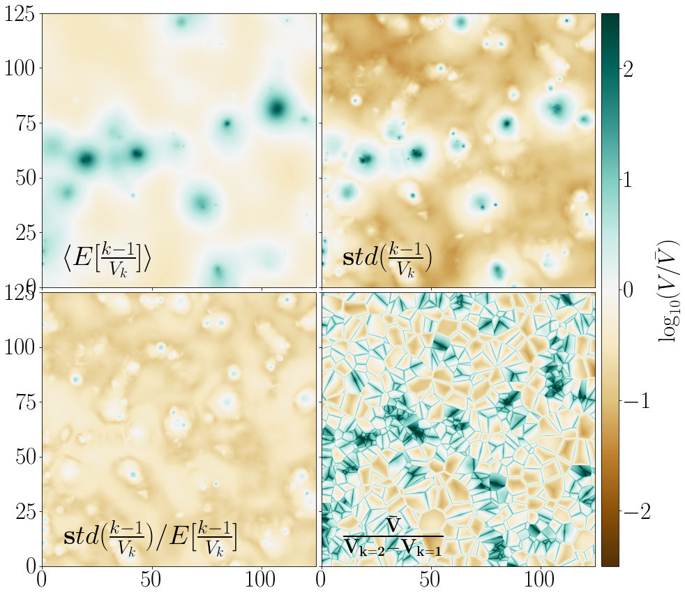

# kNN-CDFs

Very small library showing how to use [kNN-CDFs](https://arxiv.org/abs/2007.13342) in python. It leverages our small library to compress CDFs [SEDist](https://github.com/yipihey/SEDist).

There are three Jupyter notebooks that help you get started. Start with `FirstSteps.ipynb` then have a look at `LevyFlights.ipynb` and then look in `BolshoikNN-VPF-CIC-PDF.ipynb` if you are interested in applications in cosmology. 

They unify many other statistics previously discussed to describe spatial clustering. They even connect to tesselations  and also allow density estimation .