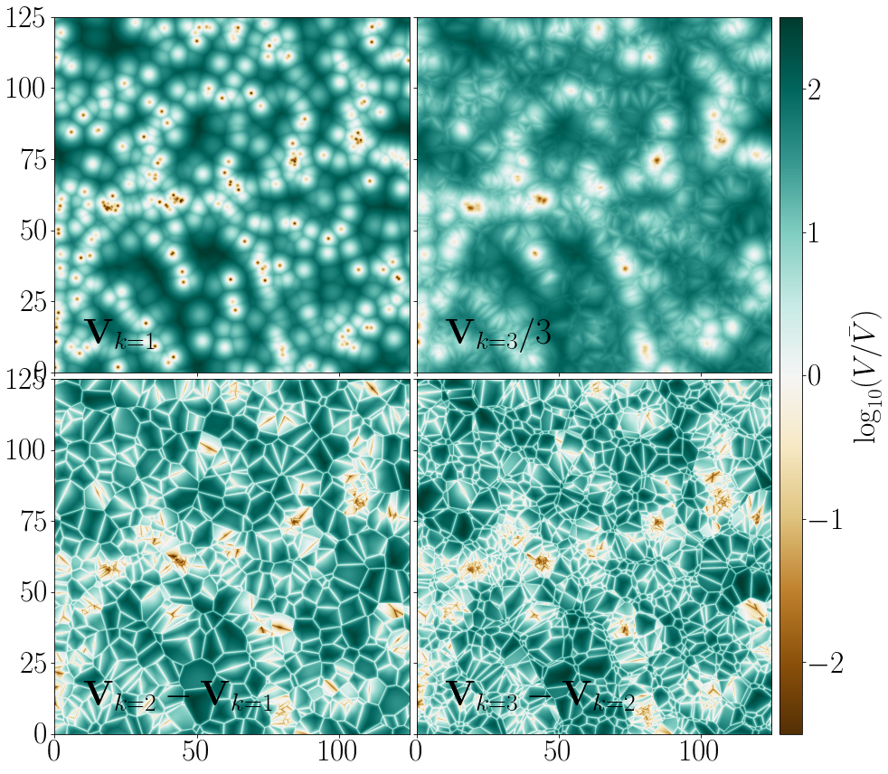

# kNN-CDFs

Very small library showing how to use [kNN-CDFs](https://arxiv.org/abs/2007.13342) in python. It leverages our small library to compress CDFs [SEDist](https://github.com/yipihey/SEDist).

They unify many other statistics previously discussed to describe spatial clustering. They even connect to tesselations .  